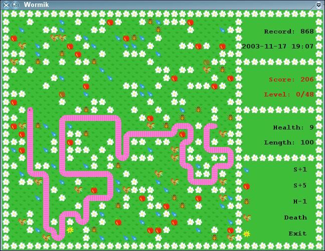
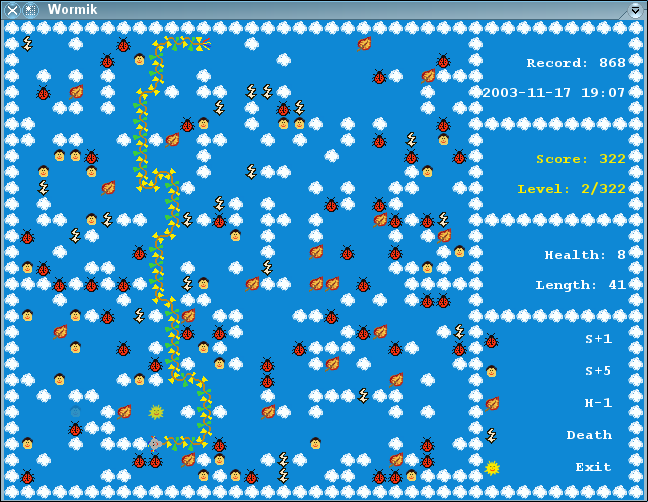

# About Wormik

Simple worm-like game.

You have to collect some food to get points and get to the next level.
Interesting anomaly is you can eat yourself and get the points for that.



# License

Licence is GPL v3 (or newer), see http://www.gnu.org/licenses/ for details.

In Windows distributions there are added some libraries - libpng, libjpeg,
libSDL, libSDL-ttf, libSDL-image. I think (hope) they all are written under
LGPL license...


# Installation

SDL2, SDL2\_image and SDL2\_ttf libraries are required for running and appropriate
development files for compiling.
Makefile is simple, no autoconf or other stuff, just run make and it should
work properly.
Built executables and resources are placed into target/ directory.
You can install it either locally into any directory and run it from there, or
install data files (wormik\_\*.png) to /usr/share/games/wormik (run make install).

```
make
make install # Or:
cd target/ && ./wormik
```


# Configuration

Usually no need to configure anything manually.

The configuration is stored in ~/.config/wormikrc, following is supported:
```
fullscreen=0 or 1		# sets fullscreen mode
datapath=path			# path to game data (default is /usr/share/games/wormik/ )
font=/usr/.../fontfile.ttf	# use if game cannot find font (default depends on system)
fontsize=<number>		# if fonts are too big, change it
record=...			# you can modify your records ;o)
```


# Controls

- arrows	- changing snake direction
- f		- toggle fullscreen mode
- p		- pause
- q, Esc	- quit
- h		- show help
- a		- about
- return	- close dialog


# Rules

Description of tiles is available when playing the game.

Positive: first advances your score by two and length by one, the second
advances your score by five and length by two.

Negative: only one, decrements your health by one and your length by one.

All the others tiles will kill you.

You can eat yourself too, then your health is halved (except when you eat only
your tail - then health is decremented by one). If you have enough points to
exit, then score is advanced by number of eated cells.

More points are added when reaching exit (8\*level\_num) etc.


# Authors

Zbyněk Vyškovský <kvr000@gmail.com> , https://github.com/kvr000/wormik/

That's all, enjoy playing it, any other information is on project homepage:
http://github.com/kvr000/wormik/

Hope you'll enjoy it,
	Zbyněk Vyškovský




# History

Game was written roughly in 2003, based on SDL 1.2 library.

In 2015, the source was published to github and game was ported to SDL 2 library.
